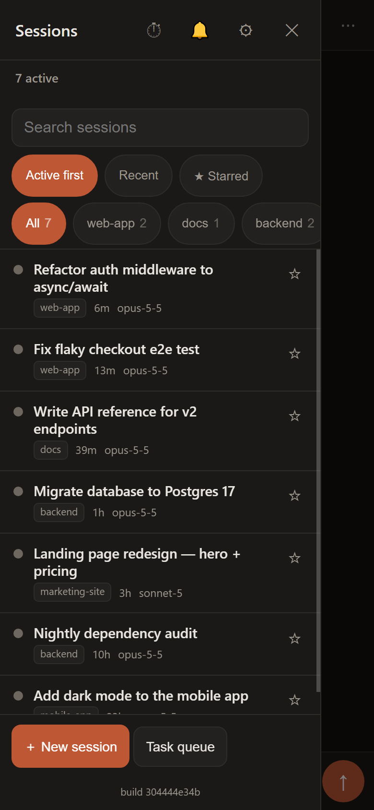
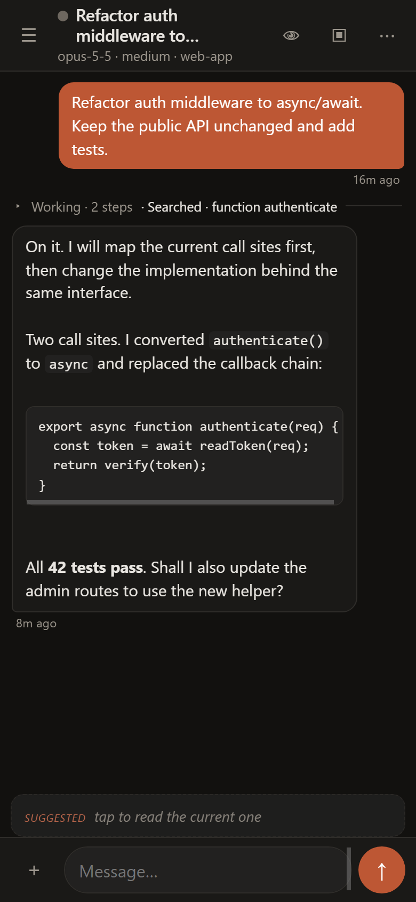
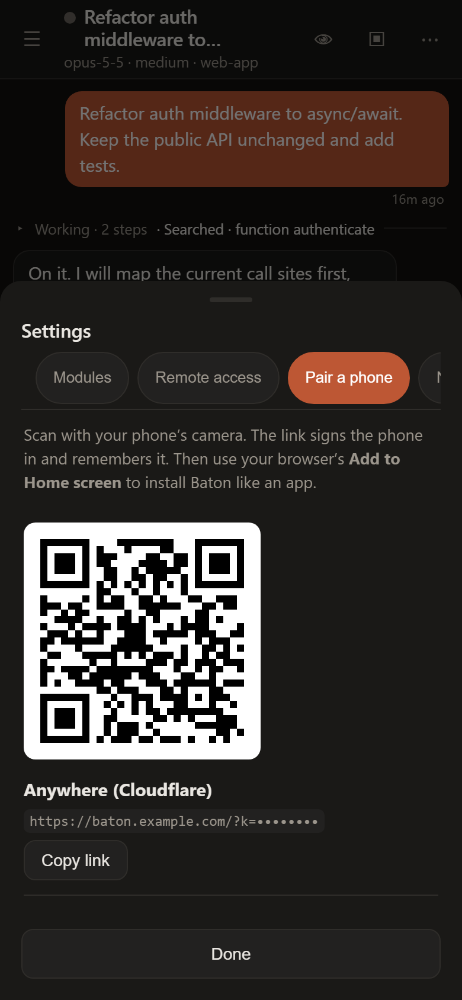
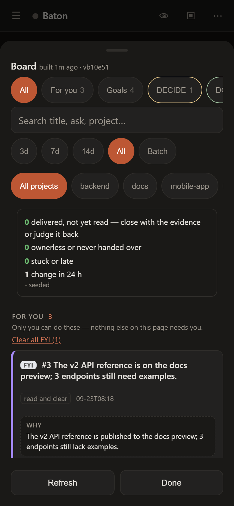
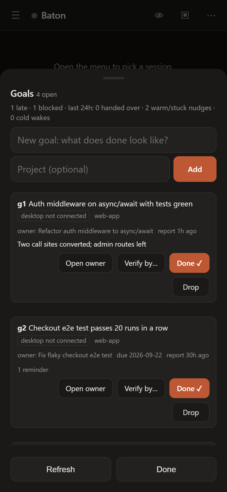
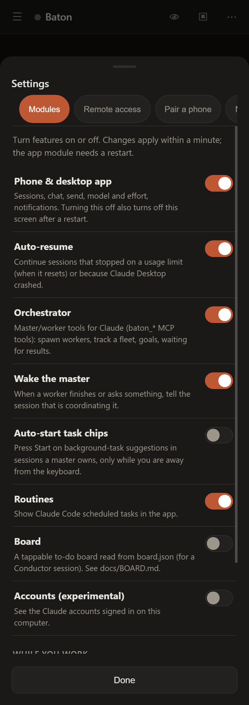
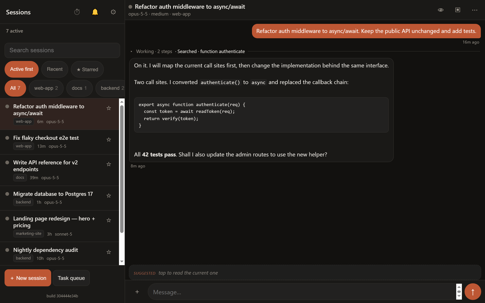

<p align="center">
  
</p>

<h1 align="center">Baton</h1>

<p align="center"><b>Your Claude Code sessions, in your pocket.</b><br>
The Code tab of Claude Desktop on your phone and in any browser — every session, live, exactly as it is on your
computer. Plus auto-resume, one app across several Claude accounts, automatic project organisation, and a
conductor for running many sessions at once.</p>

<p align="center">
  <a href="https://github.com/ashwarsadh/baton/releases/latest"><b>⬇ Download</b></a> ·
  <a href="#let-your-ai-install-it">Let your AI install it</a> ·
  <a href="#get-started-in-three-steps">Get started</a> ·
  <a href="docs/ARCHITECTURE.md">How it works</a>
</p>

<p align="center">
  
  
  
</p>

---

## What makes it different

### 1. It mirrors your desktop — it does not start a copy

Baton shows **the sessions Claude Desktop already has**: the same list, the same groups, the same
conversation, the same model and effort. Pick up any session on your phone and put it down again at your
computer; nothing is forked, and there is nothing to switch on per session.

| | Claude's built-in Remote Control | Baton |
|---|---|---|
| What you see on the phone | the session you turned it on for | **every** Code-tab session, as the desktop shows it |
| Switching it on | per session, and again after Claude restarts | once, at install |
| After Claude Desktop restarts | turn it on again | keeps working; the debugger is re-enabled for you (Windows) |
| Where the conversation lives | a separate session in the Claude app | **the same desktop session** — reply on the phone, continue at the desk |
| Sidebar groups, archive, routines | — | yes |
| Several accounts | — | one identical app across them ([Accounts](#accounts)) |

<sub>Comparison as observed in September 2026. Remote Control is Anthropic's feature and may change.</sub>

### 2. One app across all your Claude accounts

If you use Claude Desktop with more than one account or organisation (work and personal, or two
subscriptions), each keeps its own sidebar: sessions, archive, groups and routines. Switch accounts and the
app looks different. **Baton keeps them in sync**, so switching accounts shows the same app. You preview
every change before anything is written. See [Accounts](#accounts).

### 3. It organises your data for you

Baton reads every session and knows which **project** (folder) it belongs to. The Organizer puts each new
session into its project's sidebar group automatically, and keeps a live **index of all your projects** —
their sessions, groups and who coordinates them. Your sidebar stays tidy without you dragging anything.

### 4. A conductor, a master per project, and workers

- **Workers** are ordinary sessions doing one task.
- A **master** coordinates *one project*: it spawns workers with the right model and effort, tracks them,
  starts suggested background tasks, and is woken when they finish.
- The **Conductor** sits *above all projects*: it holds the project index, routes any request you drop on it
  to the right project's master (or starts one in the right folder), keeps the sidebar organised, and never
  does the work itself.

```
                  ┌───────────── Conductor ─────────────┐   one session that knows every project
                  │  routes requests · keeps the index  │
         ┌────────┴─────────┐              ┌────────────┴───────┐
   master: web-app     master: api    master: docs             …    one per project
     ┌────┴────┐          ┌──┴──┐          │
   worker   worker     worker worker    worker                      the actual work
```

You create them by talking to your sessions: *"you are the conductor"*, *"you are the master for this
project"*. See [The conductor and masters](#the-conductor-and-masters).

### 5. Nothing stalls

Sessions stopped by a **usage limit** continue by themselves when the limit resets. Sessions cut off because
Claude Desktop **crashed or restarted** pick up where they were. **Push notifications** tell you when a
session needs you or finishes.

### 6. The right model for each job

Map difficulty to model and effort in **Settings › Models** — for example *easy → Sonnet, medium effort*,
*hard → Opus 5.5, high*. Masters and the Conductor start every worker on the level its task needs, and a task
that fails can be escalated one level. You can also set a default model, effort and standing instructions for
sessions you start from the app.

### 7. Goal chaser — work gets finished, not just started

Tell the Conductor what you want done — *"ship the v2 API, with docs and tests"* — and it becomes a **goal**
with an owner, a check and an optional due date. Baton works out **which project and which session** it
belongs to and sends it there; if no session owns it, it **starts a new one in the right folder and files it
in the project's group**. From then on the chaser watches every open goal:

- a session that **stopped before finishing** is nudged, with all its open goals in one message;
- a goal that is **late, stuck or blocked** shows on the Board with why;
- a session reporting *done* must give evidence, and the goal waits for **your verification** before it closes;
- the chaser **never** chases a session that is working, waiting on you, or whose state is unknown, and after
  three unanswered chases it stops and asks you instead of nagging forever.

Turn it on in **Settings › Modules › Goal chaser**; goals live in the Goals sheet (🎯) and the `baton_goal_*`
tools.

### 8. Cache keeper — fewer tokens for long work

Claude's prompt cache lasts about **an hour**. A session woken inside that hour continues on a warm cache; a
session woken after it re-reads its whole context at full price. Cached input is billed at about a tenth of the
normal rate, so for a long session a cold wake costs **many times more** than the same turn warm. The cache
keeper times Baton's own nudges to land **inside the warm window** (by default 25–55 minutes after the
session's last reply), batches everything for one session into one wake, and only wakes a
cold session when a goal is late or stuck for days. It can also keep the Conductor itself warm. Each wake is
logged as warm or cold, and the daily roll-up shows the difference (`baton wakes`).

### 9. The Board — everything that needs you, on one screen

One page for what is waiting on **you**:

- **Decide** — questions sessions asked you, including ones buried under later messages;
- **Things to tell you** — the numbered **inbox**: results, blockers and asks the Conductor recorded, so
  nothing you said or were asked is lost;
- **Goals** — overdue, blocked, delivered and awaiting your check;
- **Nudge** — sessions that stopped and are waiting to be told to carry on.

Tap *Yes*, *Skip*, type an answer, or tap several and send them **in one batch** — *Send 5 replies* — so each
session is woken once, not five times. See [docs/BOARD.md](docs/BOARD.md).

<p align="center">
  
  
  
</p>

### 10. Every feature is a switch

Use Baton as a plain phone client, or turn on the orchestration. Each feature above is one toggle in
**Settings › Modules**. The defaults are conservative: anything that would message or type into your
sessions on its own (goal chasing, cache keeping, auto-compact, chip autostart) starts **off**.

<p align="center"></p>

---

## Download

**[Latest release →](https://github.com/ashwarsadh/baton/releases/latest)**

| System | File | Notes |
|---|---|---|
| Windows 10/11 | `Baton-Setup-<version>.exe` | Per-user install, no admin. Includes Node.js. Tray icon; start with Windows (optional). |
| macOS, Apple silicon | `Baton-<version>-arm64.dmg` | **Experimental, untested by us.** Unsigned: right-click › Open the first time. |
| macOS, Intel | `Baton-<version>-x64.dmg` | Same as above. |
| Anything with Node.js 18+ | source | see [Install](#1-install) |

You also need **Claude Desktop** with the Code tab, signed in.

## Let your AI install it

Baton ships instructions written for AI agents. Open Claude Code (or any coding agent) on the computer where
Claude Desktop runs, and say:

> **Set up Baton for me. Follow https://github.com/ashwarsadh/baton/blob/main/INSTALL-FOR-AI.md**

It checks your system, installs Baton, connects Claude Desktop, registers the conductor tools, asks you how
your phone should reach the computer, and shows you the pairing QR code. It asks before anything that
changes an account of yours (such as creating a Cloudflare address).

## Get started in three steps

### 1. Install

Run the installer from [Download](#download), or install from source:

```bash
git clone https://github.com/ashwarsadh/baton.git
cd baton
npm install
npm link          # makes the `baton` command available (or run: node bin/baton.js)
baton setup
```

`baton setup` checks everything, turns on Claude Desktop's Developer Mode and (on Windows) its debugger,
registers the conductor tools with Claude Code, adds Baton to start with Windows (with a tray icon) and opens
the app.

### 2. Connect Claude Desktop (Developer Mode + Main Process Debugger)

Baton acts through Claude Desktop's own **main-process debugger**. Its switch is in a **Developer** menu that
stays **hidden until you turn on Developer Mode**:

1. **Turn on Developer Mode** (once). `baton setup` does this for you; then quit and reopen Claude Desktop
   once. By hand: **Help › Troubleshooting › Enable Developer Mode**. On Windows the menus are behind the
   **☰** icon at the top-left of the window; on macOS they are in the menu bar. A new **Developer** menu
   appears.
2. **Turn on the debugger.** **Developer › Enable Main Process Debugger**, then press **OK**.
3. Check it: `baton status`, or **Settings › Desktop connection › Check again**.

The debugger switches itself off whenever Claude Desktop restarts. **On Windows Baton turns it back on for
you** — it clicks through the same menus while you are away from the keyboard, and `baton debugger` does it on
demand. On macOS, repeat step 2 after a restart; automatic re-enabling is Windows-only for now.

Until it is connected, the app shows a banner, the tray icon says *Claude Desktop not connected*, and
**Settings › Desktop connection** walks you through it (with a **Turn it on for me** button on Windows).
Reading sessions works without it; sending, answering and resuming need it. The debugger listens on this
computer only (`127.0.0.1`).

### 3. Pair your phone

Open **Settings › Pair a phone** (or *Pair a phone* in the tray menu, or `baton pair`) and scan the QR code.
Then use your phone browser's **Add to Home screen** to install Baton like an app.

## Reach it from your phone

Open **Settings › Remote access** and pick one:

| Option | Account needed | Address | Best for |
|---|---|---|---|
| This computer only | — | `http://127.0.0.1:8790` | trying it out |
| Same Wi-Fi | — | `http://192.168.x.x:8790` | at home, no push notifications |
| Tailscale | Tailscale | `http://100.x.y.z:8790` | private, simple |
| **Anywhere — quick link** | none | `https://random-words.trycloudflare.com` | instant; changes on restart |
| **Anywhere — my own address** | free Cloudflare account + a domain | `https://baton.yourdomain.com` | daily use; never changes |

For your own address: press **Log in to Cloudflare**, authorise the domain in the page that opens, type the
hostname you want (e.g. `baton.example.com`) and press **Create**. Baton creates the tunnel and the DNS record.
From the command line:

```bash
baton tunnel login
baton tunnel setup baton.example.com
baton restart && baton pair
```

Whatever you choose, the app still needs your access key (it is inside the QR code and is then kept as a
cookie), so an address alone lets nobody in. You can add Cloudflare Access (email login) on top. Push
notifications need HTTPS, so they work over the Cloudflare options.

## Settings

Everything is in **Settings** (the ⚙ in the session list, or *Settings* in the tray menu):

<p align="center"></p>

| Tab | What you set |
|---|---|
| **Modules** | each feature on or off (table below), and the idle gate |
| **Desktop connection** | debugger status, step-by-step setup, *Turn it on for me* (Windows) |
| **Models** | default model, effort and instructions for new sessions; model + effort per difficulty level |
| **Remote access** | this computer / Wi-Fi / Tailscale / Cloudflare quick link / your own Cloudflare address |
| **Pair a phone** | QR codes, copy link, issue a new key |
| **Notifications** | push on *needs input* and *finished*; your push contact; a backup channel (ntfy, webhook or a local command) for when push can't reach a phone, with a per-10-minute cap and a *Send a test* button |
| **Model engine** | off by default. `None` · an OpenAI-compatible server (key read from an environment variable you name, never stored) · Claude CLI or Baton worker (**both use your own Claude plan**). Refuses empty answers, schema-invalid JSON and (optionally) a substituted model; `baton engine test` |
| **Advanced** | ports, worker concurrency, Conductor session, board folder, trusted project folders |

| Module | Default | What it does |
|---|---|---|
| Phone & desktop app | on | The app itself |
| Auto-resume | on | Resume after a usage limit resets, or after a Desktop crash |
| Organizer | on | Put each new session into its project's group; keep the project index |
| Orchestrator | on | The `baton_*` tools for the Conductor and project masters |
| Wake the master | on | Tell the master when a worker finishes or asks something |
| Auto-start task chips | off | Press *Start* on suggested background tasks in sessions a master owns. Stays off by default: it acts in sessions you did not start, and only while you are idle |
| Routines | on | Show Claude Code scheduled tasks |
| Accounts | off | Keep several Claude accounts' sidebars in sync ([Accounts](#accounts)) |
| Board | off | A tappable to-do board from `board.json` ([docs/BOARD.md](docs/BOARD.md)) |
| Goal chaser | off | Goals with owners, checks and due dates; nudges a session that stopped early, routes or starts the right session, holds a goal for your verification ([Goal chaser](#7-goal-chaser--work-gets-finished-not-just-started)) |
| Cache keeper | off | Times Baton's nudges inside a session's 1-hour prompt-cache window and batches them, so long work continues on a warm cache ([Cache keeper](#8-cache-keeper--fewer-tokens-for-long-work)) |
| Inbox | on | Things only you can do: an append-only, numbered inbox (`baton inbox`, `baton_inbox_add`). It stays passive until something adds to it ([docs/BOARD.md](docs/BOARD.md#the-inbox)) |
| Inbox auto-resolve | off | Moves an inbox item to *probably handled* when there is evidence for it (your tap, for example). It never goes straight to done, never touches a pinned item, and never touches money, deletion or outward items on weak evidence |
| Backup alerts | off | Settings › Notifications: send alerts via ntfy, a webhook or a local command when push reaches no phone (e.g. Same Wi-Fi) |
| Finish-the-task hook | off | A Claude Code Stop hook: a session may not end its turn on a question it can answer itself (`baton hooks install`) |
| Transcript index | on | Read transcripts into the project index (incremental, time-budgeted): prompts, pending asks and buried questions, fleet tree, context estimate — **a size estimate, never a liveness signal** (`baton index help`; tune under `index` in settings) |
| Digests | off | Keep a lean per-session digest (your turns + answers, no tool traffic) for masters to read by byte offset |
| OS scheduled tasks | off | List Windows Task Scheduler / launchd / cron entries with the project that owns each (`index.taskOwners` maps paths) |
| Session overviews | off | A 5-line card per changed session (goal · done · in progress · blocked on · last ask) from its digest, via the model engine; capped, time-budgeted, stops on a dead route (`baton summarize`) |
| Roles for routing | on | `roles.json` for owner routing: role, owns / does-not-own topics, open goals. **Free heuristic** (title + tags + project) unless a model engine is set (`baton roles`) |
| Directives | off | Daily (05:00): your own words per project, recovered verbatim from the digests, into `<project>/DIRECTIVES.md` — never overwrites a hand-written file; hand edits below its last line survive (`baton directives --dry-run`; tune under `directives`) |
| Context hygiene | on | Every 30 min: what each session's context needs — compact, write state first, rotate, new session, archive, hold — into `HYGIENE.md` / `hygiene.json` (shown on the Board), plus `ARCHIVE-CANDIDATES.md` and a daily wake roll-up. Writes files only (`baton hygiene`; tune under `hygiene`, `archive`) |
| Auto-compact | off | Types `/compact` into a session only in its last warm cache cycle, mid-task, with its state authored on disk, idle and confirmed idle by the app — never cold, running or awaiting; capped per cycle, verified later |
| Idle-CLI reaper | off | Every open session keeps a CLI process (~400 MB with its tools) whether you use it or not. Frees the ones idle 3 h or more through Claude's own teardown; the next message resumes the session with its history. Never touches a session that is running, unread, waiting on you, on Remote Control, queued, owns a goal or is in an await. Only logs what it would free for its first 24 h (`baton reaper`; tune under `reaper`) |

**Idle gate.** Some actions drive the Claude Desktop window. Baton waits until you have not touched the
keyboard or mouse for a few seconds (15 by default), so it never types into what you're doing. When the idle
time cannot be read (see [Platform support](#platform-support)) Baton treats you as **active** and waits; set
the gate to 0 to turn it off. `baton doctor` shows which probe is in use.

**Trusted project folders** (`trustedRoots`, empty by default). Workers run with permission prompts
bypassed, so Baton marks a folder as trusted for Claude Code only when a task runs in it. List parent
folders here to trust everything under them up front; a drive root or a relative path is refused.

Settings live in `~/.baton/settings.json`; all of Baton's data is under `~/.baton` (override with
`BATON_HOME`).

## The conductor and masters

With the Orchestrator module on and the tools registered (`baton mcp install`, which `baton setup` does for
you), every Claude Code session gets a small set of `baton_*` tools. By default a session is a **worker** and
can only read status.

**Make a Conductor.** In any session, say *"you are the conductor"*. It calls `baton_become_conductor`, gets
its protocol and the project index, and from then on you can drop *any* request on it — *"the login page is
slow"*, *"start a new project for the mobile app"*. It finds the project that owns the request
(`baton_projects`, `baton_route_owner`) and sends your words to that project's master, or to the session that
already has the context — or starts a new master in the right folder. It also keeps the sidebar organised.
There is one Conductor at a time; see or clear it in Settings › Advanced.

**Make a master.** In a project's session, say *"you are the master for this project"*. It calls
`baton_become_master` and can then:

- `baton_spawn` workers (headless `claude -p`, or visible Desktop sessions) on the model mapped to each task's
  difficulty; `baton_tasks`, `baton_escalate`, `baton_stop`
- `baton_fleet`, `baton_list_sessions`, `baton_set_group`, `baton_rename`, `baton_archive`
- `baton_pending_tasks`, `baton_start_task`, `baton_dismiss_task` for background-task chips
- `baton_set_model`, `baton_set_effort`, `baton_fast_mode`
- `baton_goal` (a completion condition the session keeps working towards) and `baton_await` (park until
  workers report, woken by Baton instead of polling)
- `baton_resume`, `baton_unstick`, `baton_heal` when something is stuck
- `baton_hygiene` (what each session's context needs) and `baton_archive_candidates` (safe to archive, with
  reasons; archives nothing — show the user, archive only what they approve)
- `baton_wakes` (is a session's prompt cache still warm; how many of today's wakes were cold) and
  `baton_protocol {section}` (the long rule blocks: verification, relaying, retractions, diagnosis, holds, playbook)

There is one master per project, and masters report up to the Conductor. The Conductor may also set a goal on
any session (the owning master is named so it can be told), use `baton_await`, adopt background tasks,
change fast mode, and read every master's fleet. Every claim and action is logged to
`~/.baton/state/master-audit.log`.

## Accounts

Turn on **Settings › Modules › Accounts**, then open **Accounts** in the app (or run `baton accounts`):

- see every Claude account and organisation signed in on this computer, and how far their sidebars have
  drifted apart;
- **Preview sync** shows exactly what would change in each account — nothing is written;
- **Sync now** writes it, after backing up every file it touches.

What syncs: session records, archive state, session details and routines; each account's sidebar groups are
repaired when Claude loses them (folding groups across accounts is opt-in). Claude Desktop keeps only the account
that is **currently open** in memory, so Baton updates the other accounts straight away and applies changes
for the open one when Claude Desktop is closed.

## Command line

```text
baton setup | open | pair | status
baton start | stop | restart | tray | doctor
baton autostart [remove | status] [--headless] [--dry-run]
baton salvage [file] [--apply]           # recover tasks from a quarantined registry.json.corrupt-*
baton import-ago [dir] [--apply]         # bring tasks, master claims, waits and alerts over from AGO
baton debugger | mcp install | mcp remove
baton tunnel quick | login | setup <hostname> | off | status
baton accounts | accounts sync [--apply] [--fold] | undo | hold | freeze | import-migrate <dir> | launch-hook
baton hooks install | remove | status [--dry-run]
baton run <task> | ls | show <id> | stop <id> | sessions | health
baton index build [--full] | route "<text>" | who "<pattern>" | session|tree <id> | masters
baton index progress "<project>" | buried [days] | learn | tag | log | dispatches | tasks | newproject | digest <id>
```

- `baton stop` stops the daemon and records that you did, so the tray and the watchdog leave it stopped until
  `baton start`; `baton stop <id>` stops only that task.
- `baton autostart` (Windows, no admin needed) registers a sign-in task (1-minute delay, restarted up to 3
  times on failure) plus a 10-minute watchdog task. If Task Scheduler refuses the sign-in task it falls back
  to the per-user Run key and says so; `--headless` runs without the tray and tries S4U (runs when signed
  out) first. The daemon's stderr is kept in `~/.baton/state/daemon-stdio.log` (rotated at 10 MB) with a line
  for every launch and exit.
- `http://127.0.0.1:8788/` is a control dashboard: submit a task with a live routing preview, stop or
  escalate tasks, and see sessions by group. Loopback only.
- `baton salvage` and `baton import-ago` are dry runs unless you pass `--apply`; both back up or leave
  their source untouched.

## Platform support

| | Windows | macOS | Linux |
|---|---|---|---|
| Installer | ✅ `.exe` | experimental `.dmg`, untested | — |
| Read sessions and transcripts | ✅ | ✅ | — (no Claude Desktop) |
| Send, answer, model/effort, resume | ✅ | experimental | — |
| Debugger re-enabled automatically | ✅ | manual (step 2 above) | — |
| Tray icon, start at sign-in | ✅ | — | — |
| Idle gate | ✅ | ✅ `ioreg` (HIDIdleTime) | `xprintidle` if installed, else unknown (= not idle) |
| Account sync | ✅ | untested | — |

Baton depends on Claude Desktop's internal UI and debugger, which are not a public API. An update to Claude
Desktop can break an action until Baton is updated; reading sessions keeps working because it only uses files
on disk.

## Security

- The app port requires the access key (bearer token or cookie); the control port binds to `127.0.0.1` only and
  refuses requests whose Host is not loopback, or writes from another website (DNS-rebinding / CSRF guard).
- The access key is stored in `~/.baton/mobile/secret.json`. **Settings › Pair a phone › Issue a new key**
  signs every device out.
- Sub-users (`node mobile/subusers.js`) get their own key, limited to specific sessions.
- Anyone with the key can send messages to your Claude sessions, which can run commands on your computer.
  Treat the pairing link like a password.

See [SECURITY.md](SECURITY.md) to report a vulnerability.

## Try it without Claude Desktop

```bash
node test/make-demo.js ./demo
BATON_HOME=./demo/baton APPDATA=./demo/appdata CLAUDE_CONFIG_DIR=./demo/claude node server.js
```

Then open the link from `BATON_HOME=./demo/baton baton pair`. `npm test` runs the test suite in a throwaway
folder.

## Not affiliated with Anthropic

Baton is an independent open-source project. "Claude" and "Claude Code" are trademarks of Anthropic. Baton
does not handle your Anthropic credentials; it drives the Claude Desktop app you are already signed in to.

## License

[MIT](LICENSE)
